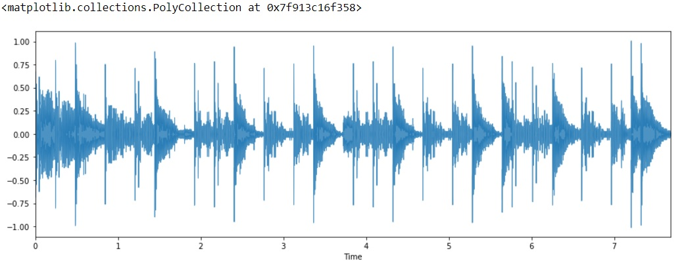

# AudioFeaturesDemos

##  01 . Audio Transcription :

See '01-Audiotranscription.ipynb' on how to transcribe (or try to!!!) audio to text using Python and Sphinx package.

## 02. Features from Audio :

See '02-Features_from_audio.pca.ipynb' on how to read , process and create features from an audio file that are suitable for further use with ML libraries such as the scikit learn package

## 03. Further reading :

For further reading on this domain area please see :

[MIR](http://musicinformationretrieval.com/)

[MIR2](https://ccrma.stanford.edu/workshops/music-information-retrieval-2016)

[Fundamentals of Music Processing book from Springer](https://www.audiolabs-erlangen.de/fau/professor/mueller/bookFMP)

